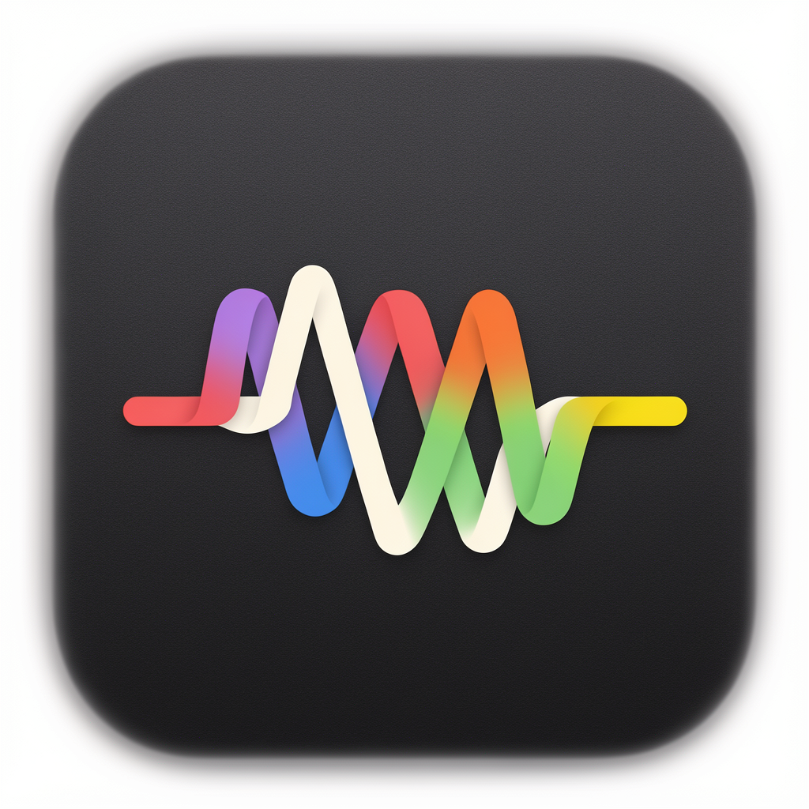

# PulseBar



PulseBar 是一款原生 macOS 菜单栏音频频谱工具。它使用 ScreenCaptureKit 获取当前系统音频，通过 Accelerate 执行 1024 点 FFT，并将实时频谱绘制在菜单栏中。

## 功能

- 响应真实系统音频，而不是随机动画
- 细条、波浪、柔光和面积频谱四种样式
- 竖向或横向显示，支持不同伸展方向和宽度
- 系统强调色、经典单色预设与高级调色
- 柱状样式支持峰值悬停
- 当前样式对应的无音频状态
- 登录时启动、睡眠唤醒恢复和音频流自动重连
- 静音时自动降低 FFT 刷新频率以减少耗电

## 系统要求

- macOS 13 Ventura 或更高版本
- Intel 或 Apple Silicon Mac
- “屏幕与系统音频录制”权限

## 安装

1. 从 GitHub Releases 下载最新的 `PulseBar-v*.dmg`。
2. 打开 DMG，将 PulseBar 拖到“应用程序”。
3. 首次启动后按系统提示允许“屏幕与系统音频录制”。
4. 授权后重新启动 PulseBar。

GitHub Actions 默认生成 ad-hoc 签名版本。若 macOS 提示无法验证开发者，请在“系统设置 > 隐私与安全性”中选择“仍要打开”。使用 Developer ID 签名并公证的版本不会出现该提示。

## 源码构建

需要 Xcode Command Line Tools：

```bash
xcode-select --install
./script/test.sh
./script/build_and_run.sh
```

生成 Intel 与 Apple Silicon 通用 DMG：

```bash
./script/package_dmg.sh
```

产物位于 `outputs/PulseBar.dmg`。

## Developer ID 签名与公证

先将 notarytool 凭据保存到钥匙串：

```bash
xcrun notarytool store-credentials PulseBar-notary \
  --apple-id "APPLE_ID" \
  --team-id "TEAM_ID" \
  --password "APP_SPECIFIC_PASSWORD"
```

再构建、公证并装订 DMG：

```bash
SIGN_IDENTITY="Developer ID Application: NAME (TEAM_ID)" \
NOTARY_PROFILE="PulseBar-notary" \
./script/package_dmg.sh
```

凭据只保存在本机钥匙串中，不应提交到 GitHub。

## GitHub 发布

推送 `v1.10.0` 这类与 `VERSION` 一致的标签后，Release workflow 会自动：

1. 运行频谱检查
2. 构建通用 DMG
3. 生成 SHA-256 文件
4. 创建 GitHub Release

```bash
git tag v$(cat VERSION)
git push origin v$(cat VERSION)
```
